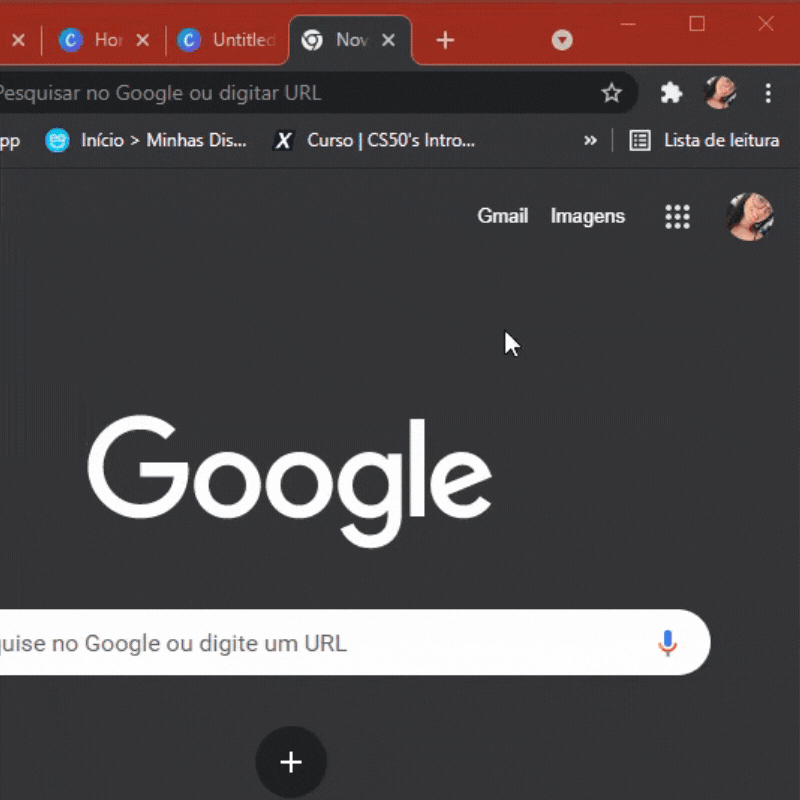
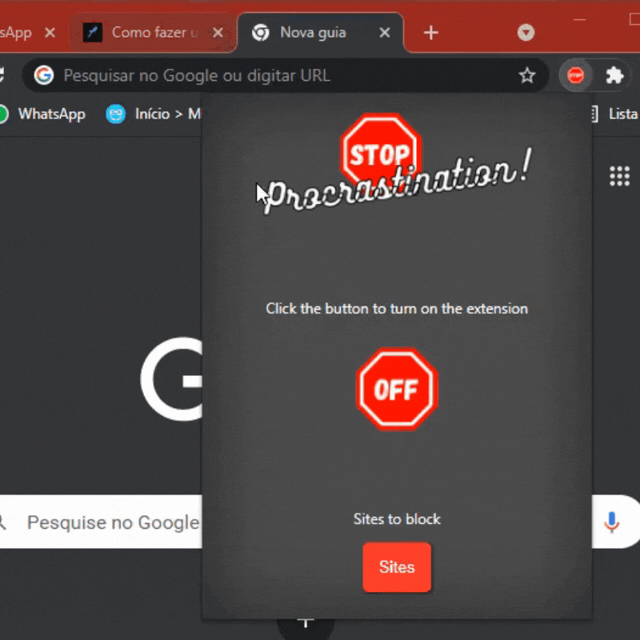

 

<h3 align="center">
 A Chrome extension that tries to stop procrastination
</h3>
<h5 align="center">My final project for CS50's Introduction to computer science course by HarvardX</h5>

<h4 align="center"> 
	🚧  Stop Procrastination is still under construction...  🚧
</h4>

 <a href="#about">About</a> •
 <a href="#features">Features</a> • 
 <a href="#run">How to run</a> • 
 <a href="#author">Author</a> • 
 <a href="#more">More</a> 

<h1 align="center">
  
  
</h1>

<h3 id="features">✨Features</h3>

 - [x] Customize websites
 - [x] Enable and disable extension
 - [x] Display a message when active and on one of the registered sites
 - [ ] Option to block registered sites

<h3 id="run">⚙ How to run</h3>

Unfortunately, I haven't been able to publish it to the chrome web store yet, so for now you'll have to:

<ul>
	<li>Install the project</li>
	<li>Go to chrome://extensions/</li>
	<li>In the upper right corner, turn on Developer Mode</li>
	<li>Click "load without compression"</li>
	<li>Find and select the extension folder</li>
</ul>

That's it, now you can open it on your own machine as any other extension and edit it in your code editor

<h3 id="more">📌 More</h3>

This is the link to my explanatory video about the project, required by the course:

<a href="https://youtu.be/5t_cCtUJYG0">https://youtu.be/5t_cCtUJYG0</a>

<h3 id="author">👩‍💻 Author</h3>

Taissa Silva

 

